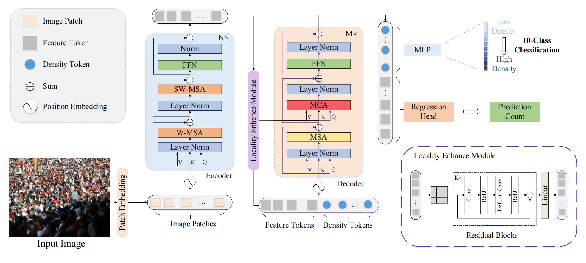

# DensityToken: Weakly-Supervised Crowd Counting with Density Classification
* This repository is the official implementation of our method DSFormer(Dual Supervision Transformer). In this work, we propose a transformer-based weakly-supervised crowd counting framework with density tokens to perform density classification.

## Overview


# Environment

	python >=3.6 
	torch >=1.8.0
	opencv-python >=4.4.0
	scipy >=1.4.0
	h5py >=2.10
	pillow >=7.0.0
	imageio >=1.18
	timm==0.1.30
    tqdm==4.64.0
    grad-cam==1.4.6
- Some crucial packages are listed above. Please make sure to install them before running.
# Datasets
Three datasets are utilized in our proposed method, where links are shown below:
- Download ShanghaiTech dataset from [Baidu-Disk](https://pan.baidu.com/s/15WJ-Mm_B_2lY90uBZbsLwA), passward:cjnx; or [Google-Drive](https://drive.google.com/file/d/1CkYppr_IqR1s6wi53l2gKoGqm7LkJ-Lc/view?usp=sharing)
- Download UCF-QNRF dataset from [here](https://www.crcv.ucf.edu/data/ucf-qnrf/)
- Download NWPU-CROWD dataset from [Baidu-Disk](https://pan.baidu.com/s/1VhFlS5row-ATReskMn5xTw), passward:3awa; or [Google-Drive](https://drive.google.com/file/d/1drjYZW7hp6bQI39u7ffPYwt4Kno9cLu8/view?usp=sharing)


# Training


```
python train.py --dataset ShanghaiA
```


# Testing

You can download the pretrained model from [Baidu-Disk](https://pan.baidu.com/s/1TIqgYdlDp6oa5kF16PKMMg), passward:DSFO

```
python test.py --dataset ShanghaiA  --pre model_best.pth
```

## Citation
You may consider kindly citing our work if you find this useful. Great thanks!

``` bibtex
@inproceedings{hu2023densitytoken,
  title={Densitytoken: Weakly-Supervised Crowd Counting with Density Classification},
  author={Hu, Zaiyi and Wang, Binglu and Li, Xuelong},
  booktitle={ICASSP 2023-2023 IEEE International Conference on Acoustics, Speech and Signal Processing (ICASSP)},
  pages={1--5},
  year={2023},
  organization={IEEE}
}
```

# Acknowledgement
This code is heavily built on [TransCrowd](https://github.com/dk-liang/TransCrowd). We sincerely thank the authors for sharing the codes.

